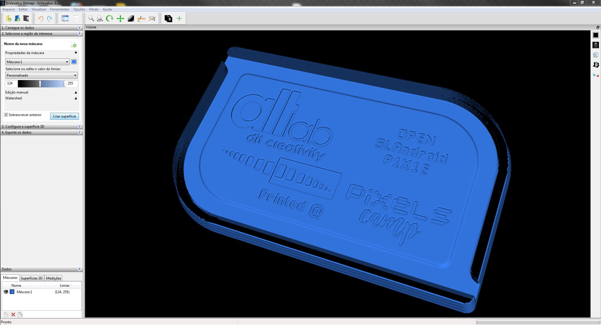

**Optimus Madrid LCD**

- Resolution: 480x800 (px)
- Active Area: 56.16x93.60 (mm)
- Pitch: 117 (microns)
- Theorethical minimum printable detail: 120 micron voxel (0.12mm)

---

**Test print preview simulation, rebuilt from layers with Invesalius**

- The test print badge is designed for quick print at 50u with minimum material use.
- It features a small group of test bars to test minimum negative and positive details. 
- It was designed to print at 40x25x2mm (WxHxD) on this particular LCD screen pitch
